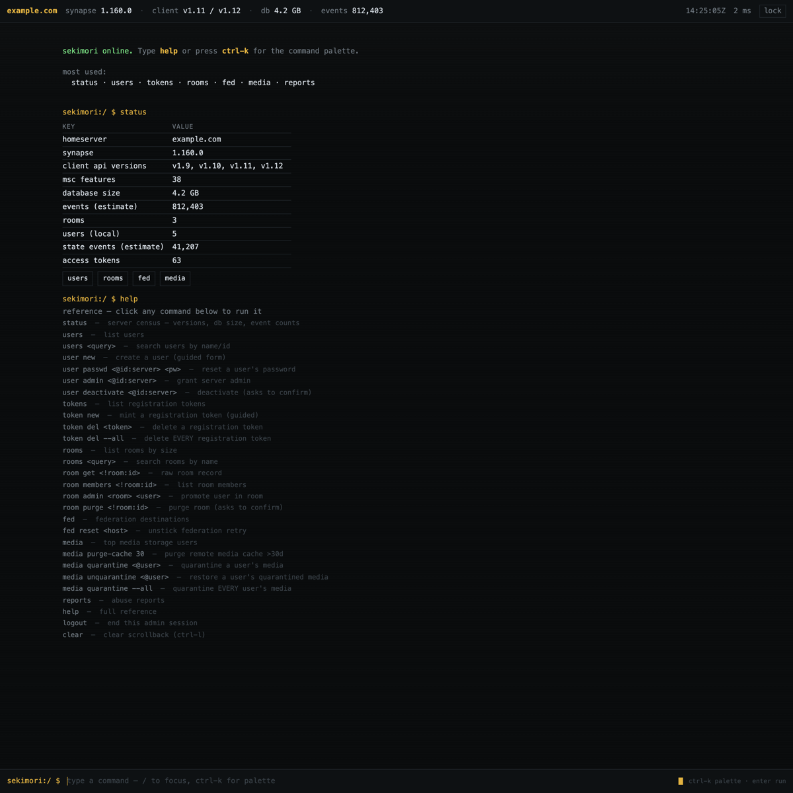

# sekimori

An admin CLI and minimal web UI for [Matrix](https://matrix.org) homeservers running
[Synapse](https://github.com/element-hq/synapse).

Manage users, registration tokens, rooms, federation, media and abuse reports from
either the terminal or a browser, without hand-rolling `curl` calls against the
admin API.

## Features

- **Users** — list, search, create, reset passwords, grant/revoke admin, list
  devices, inspect uploaded media, deactivate
- **Registration tokens** — list, mint, revoke, delete all
- **Rooms** — search, inspect state and members, promote room admins, purge
- **Federation** — destination status and retry resets
- **Media** — storage usage per user, quarantine/unquarantine, remote cache purge
- **Reports** — abuse report queue
- **Census** — Synapse version, client API versions, database size and row counts
- Password-protected web UI with command palette and keyboard-driven navigation
- `--json` output on every CLI command for scripting

## Requirements

- Python 3.9+
- A Synapse homeserver with the admin API reachable and an admin access token
- `bottle` (only runtime dependency)
- Optional: `psql` and Postgres read access, for database census numbers

## Install

```bash
pipx install git+https://github.com/kypwny/sekimori
```

Or from a clone:

```bash
git clone https://github.com/kypwny/sekimori
cd sekimori
python3 -m venv .venv && .venv/bin/pip install -e .
```

This installs three commands: `sekimori` (CLI), `sekimori-web` (web UI) and
`sekimori-setup` (config generation).

## Configuration

Settings live in `/etc/sekimori/config.json`, including the Synapse admin token
and database password, so it's written mode `0640`. Override the path with
`$SEKIMORI_CONFIG`.

Generate it:

```bash
sudo sekimori-setup \
  --server-name example.com \
  --public-baseurl https://matrix.example.com \
  --admin-token syt_your_admin_token \
  --db-name synapse --db-user synapse --db-password 'your-db-password'
```

It prints a generated web UI password once. To set your own, add
`--password 'your-password'`; to rotate the session signing key without changing
the password, use `--rotate-password`.

See `config.example.json` for the full set of keys.

## Usage

### CLI

```bash
sekimori info                              # versions, db size, census
sekimori users list --limit 50
sekimori users list --search alice
sekimori users new @alice:example.com --password 'hunter2'
sekimori users passwd @alice:example.com 'new-password' --logout
sekimori users admin @alice:example.com            # --revoke to undo
sekimori users deactivate @spammer:example.com --yes
sekimori users devices @alice:example.com

sekimori tokens list
sekimori tokens new --uses 5
sekimori tokens del <token>
sekimori tokens del --all --yes

sekimori rooms list --search debate
sekimori rooms members '!room:example.com'
sekimori rooms make-admin '!room:example.com' @alice:example.com
sekimori rooms purge '!room:example.com' --yes

sekimori federation list
sekimori federation reset matrix.org

sekimori media stats
sekimori media quarantine @spammer:example.com
sekimori media unquarantine @spammer:example.com
sekimori media purge-cache 30 --yes

sekimori reports
sekimori --json users list
```

Destructive commands require `--yes`, so a typo can't take effect on its own.

### Web UI



```bash
sekimori-web        # 127.0.0.1:9099
```

It binds to loopback by default. To reach it from elsewhere, forward it over SSH
rather than exposing the port:

```bash
ssh -L 9099:127.0.0.1:9099 you@server
```

Then open `http://localhost:9099` and sign in with the password from
`sekimori-setup`.

Type commands into the prompt (`status`, `users`, `tokens`, `rooms`, `fed`,
`media`, `reports`, `help`); results print into the scrollback. Keyboard:

| Key | Action |
| --- | --- |
| `ctrl-k` | command palette |
| `/` | focus the prompt |
| `↑` `↓` | command history |
| `tab` | complete command |
| `ctrl-l` | clear scrollback |

## Running as a service

**systemd:**

```bash
sudo useradd --system --no-create-home --shell /usr/sbin/nologin sekimori
sudo install -d -o sekimori -g sekimori /etc/sekimori
sudo install -m 0644 deploy/systemd/sekimori.service /etc/systemd/system/
sudo systemctl enable --now sekimori
```

**OpenRC (Alpine):**

```bash
sudo install -m 0755 deploy/openrc/sekimori /etc/init.d/sekimori
sudo addgroup -S sekimori && sudo adduser -S -D -H -G sekimori -s /sbin/nologin sekimori
sudo rc-update add sekimori default && sudo rc-service sekimori start
```

Adjust `ExecStart=` / `command=` if you installed with pipx or into a virtualenv.

## Security

The web UI can drive the Synapse admin API, so treat access to it as equivalent
to an admin token.

- Password is scrypt-hashed; sessions are HMAC-signed cookies (HttpOnly,
  SameSite=Strict, `Secure` over HTTPS)
- All routes except `/login` require authentication; API calls return `401`,
  pages redirect to the login form
- Failed logins are rate-limited per IP with exponential backoff
- Non-GET requests are also checked against the `Origin` header

It listens on `127.0.0.1` and should stay there. If you need remote access, put a
reverse proxy with TLS and its own authentication in front of it.

## Tests

```bash
python -m pytest tests/
```

## License

MIT — see [LICENSE](LICENSE).